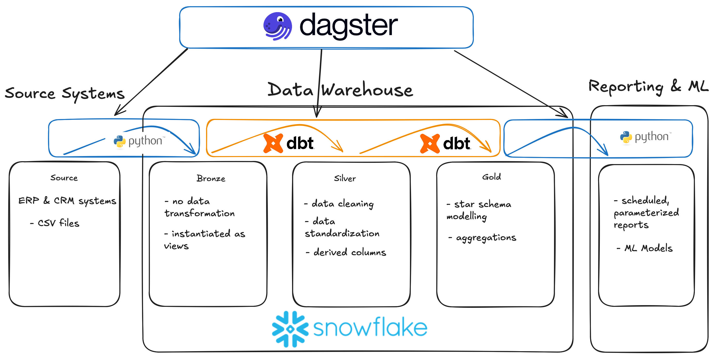
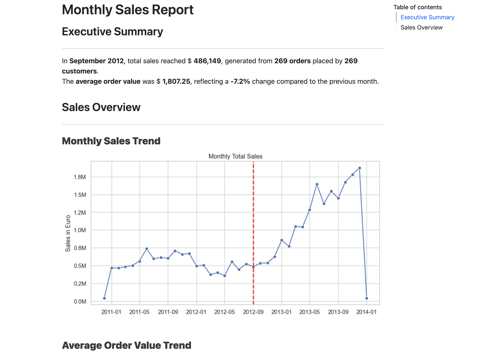
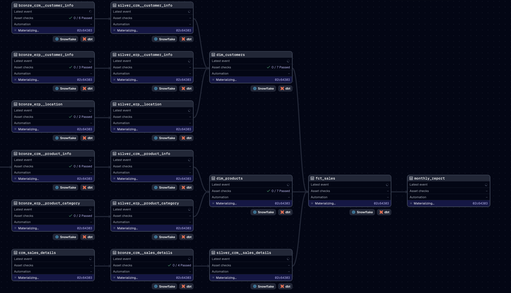

# Modern Data Warehouse & Analytics Project
This project showcases an end-to-end modern data analytics workflow — from
raw data ingestion to analytics-ready data models and automatic report
generation — using **Snowflake**, **dbt**, and **Dagster**.

## Project Overview

### Monthly Sales Report

## Motivation & Learning Outcomes

I created this project to deepen my understanding of modern data engineering
practices and gain a overview of the end-to-end data lifecycle — from raw data
ingestion to analytics-ready insights. My main goal was to learn how to use dbt
for modular, testable and version controlled data transformations, explore
workflow orchestration with Dagster, and strengthen my skills in data modeling. 

## Customer Story
As an online retail company, our sales, customer, and product data come from
multiple systems — making it difficult to generate consistent, timely insights.
To support better decision-making, reporting, and to free up resources within
our data department we needed a modern, automated
data platform that could unify these data sources and streamline our analytics
workflow.

The result is a centralized, automated, and analytics-ready data environment
that enables faster, more reliable insights into customer behavior, product
performance, and sales trends.

## Data Architecture

The project follows the Medallion Architecture pattern — a layered data architecture for building scalable and maintainable analytics systems:

- **Bronze**: load data 'as-is' no transformations
- **Silver**: clean and standardize data, data enrichment, no joins
- **Gold**: model data according to business requirements for easy querying

## Acknowledgements
The data and inspiration for this project comes from this [repository](https://github.com/DataWithBaraa/sql-data-warehouse-project) and I adapted it to use dbt instead of raw sql, choose snowflake as datawarehouse solution and dagster to orchestrate and schedule the execution of the jobs.
