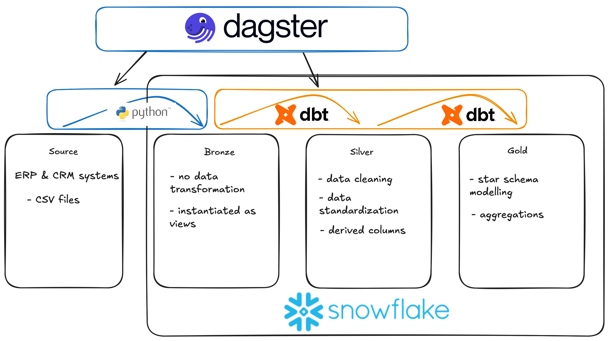
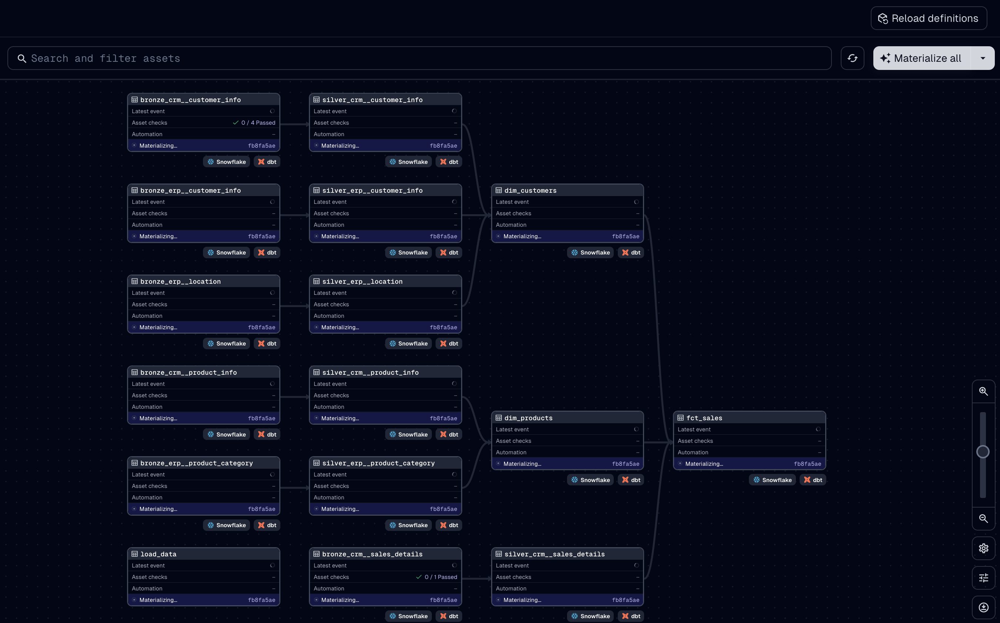

# Modern Data Warehouse & Analytics Project
This project showcases an end-to-end modern data engineering workflow — from raw data ingestion to analytics-ready data models and insights — using **Snowflake**, **dbt**, and **Dagster**.

## Overview

## Motivation & Learning Outcomes

I created this project to deepen my understanding of modern data engineering practices and gain a overview of the end-to-end data lifecycle — from raw data ingestion to analytics-ready insights. My main goal was to learn how to use dbt for modular, testable and version controlled data transformations, explore workflow orchestration with Dagster, and strengthen my skills in data modeling. 

## Customer Story
As an online retail company, our sales, customer, and product data come from multiple systems — making it difficult to generate consistent, timely insights. To support better decision-making and reporting, we needed a modern, scalable data platform that could unify these data sources and automate our analytics workflow.

This project delivers that solution by implementing a cloud-based data warehouse and analytics pipeline using Snowflake, dbt, and Dagster. It modernizes our data flow end-to-end — from ingestion and transformation to business-ready reporting — following the Medallion Architecture (Bronze, Silver, Gold layers).

The result is a centralized, automated, and analytics-ready data environment that enables faster, more reliable insights into customer behavior, product performance, and sales trends.

## Data Architecture

The project follows the Medallion Architecture pattern — a layered data architecture for building scalable and maintainable analytics systems.

